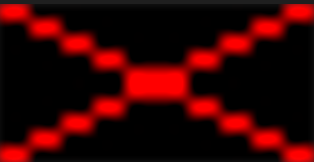

# Seam Carving

Seam carving is an image processing technique for content aware image resizing. 

## Stage 1/6:Create an image:
In this stage, a rectangle image of provided width and height is created, with a red rectangle drawn diagonally
on both sides.

[Open stage on Hyperskill](https://hyperskill.org/projects/100/stages/550/implement)

Stage implementation: [RectangleBuilder.kt](src/main/kotlin/seamcarving/RectangleBuilder.kt)

Example

    Enter rectangle width:
    > 20
    Enter rectangle height:
    > 10
    Enter output image name:
    > out.png

out.png looks like this:

