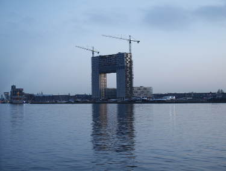

# Seam Carving

Seam carving is an image processing technique for content aware image resizing. 

## Stage 1/6: Create an image:
In this stage, a rectangle image of provided width and height is created, with a red rectangle drawn diagonally
on both sides.

[Open stage 1 on Hyperskill](https://hyperskill.org/projects/100/stages/550/implement)

Stage implementation: [RectangleBuilder.kt](src/seamcarving/RectangleBuilder.kt)

Example

    Enter rectangle width:
    > 20
    Enter rectangle height:
    > 10
    Enter output image name:
    > out.png

out.png looks like this:

## Stage 2/6: Negative photo:

In this stage, our Kotlin program converts an image into a negative one, by
inverting its rgb values.

Inverted color for `(r, g, b)` is `(255 - r, 255 - g, 255 - b)`

[Open stage 2 on Hyperskill](https://hyperskill.org/projects/100/stages/551/implement)

Stage implementation:  [ColorInverter.kt](src/seamcarving/ColorInverter.kt)

Args: `-in inputPath\imageName.png -out outputPath\outputImageName.png`

Example:

>args: `-in sky.png -out sky_negative.png`
> 
>For the following sky.png:
> 
> 
> 
> Outputs the following sky-negative.png:
> 
> 

## Stage 3/6: Look at energy:

In this stage, the energy for each pixel is calculated using the **dual-gradient energy function.**

Then, the energies are normalised using the following formula:

`intensity = (255.0 * energy / maxEnergyValue).toInt()`

And each pixel's rgb values are set to the `intensity` value, so the energy is represented as a grey-scale image.

[Open stage 3 on Hyperskill](https://hyperskill.org/projects/100/stages/552/implement)

Stage implementation: [EnergyCalculator.kt](src/seamcarving/EnergyCalculator.kt)

Example:

>args: -in sky.png -out sky-energy.png
> 
> For the following sky.png:
> 
> 
> 
> Outputs the following sky-energy.png:
> 
> 

## Stage 4/6: Find the seam

Vertical seam is a sequence of adjacent pixels crossing the image top to bottom. 
The seam can have only one pixel in each row of the image. 

For example, subsequent pixels for pixel `(x,y)`are `(x - 1, y + 1)`, `(x. y + 1)`, and `(x + 1, y + 1)`.

The best seam to remove is the seam with the lowest sum of pixel energies from all possible seams. 
The problem of finding the best seam is very similar to finding the shortest path in a graph.

 **In this stage,**

1. The energies for each pixel are calculated, based on the implementation of stage 3.

2. Cumulative energies(lowest sum of possible energies) is calculated as well, which, for each pixel in a row is the
energy of the current pixel plus the energy of one of the three possible pixels above it.

3. The vertical seam with the minimal seam energy is found. 
4. The found seam is colorized with the color red.

[Open stage 4 on Hyperskill](https://hyperskill.org/projects/100/stages/553/implement)

Stage implementation: [SeamHighlighter.kt](src/seamcarving/SeamHighlighter.kt)

Example:

> args: -in sky.png -out sky-seam.png
>
> For the following sky.png:
>
> 
>
> Outputs the following sky-seam.png:
>
> 

## Stage 5/6: Horizontal seam
In this stage, the horizontal seam for the given input image is found and is highlighted in red.

There are many ways to find a horizontal seam for an image, such as using the transposed view of an image for the vertical seam.

This implementation uses a different approach, inheriting and overriding the previous stage's implementation.

[Open stage 5 on Hyperskill](https://hyperskill.org/projects/100/stages/554/implement)

Stage implementation: [HorizontalSeamHighlighter.kt](src/seamcarving/HorizontalSeamHighlighter.kt)

Example: 
> args: -in sky.png -out sky-horizontal-seam.png
> 
> For the following sky.png:
> 
> 
> Outputs the following sky-horizontal-seam.png:
>
> 

## Stage 6/6: Resize

In this stage:
- Two more command line parameters are added, `-width`
for the number of vertical seams to remove and, `-height` for the number of horizontal seams.
- Find a vertical seam and remove all the pixels that this seam contains. Then updates the energy values, and find another vertical seam on
the resulted image and delete all the pixels that the second seam contains, repeats the process until the specified number of vertical seams are removed.
- Removes the horizontal seams the in same way, from the resulted image.
- Saves the output file to the specified path

[Open stage 6 on Hyperskill](https://hyperskill.org/projects/100/stages/555/implement)

Stage implementation: [ImageResizer.kt](src/seamcarving/ImageResizer.kt)

**Example 1:**
> args: -in sky.png -out sky-reduced.png -width 125 -height 50
>
> For the following sky.png:
> 
>
> Outputs the following sky-reduced.png:
>
> 

**Example 2:**
> args: -in trees.png -out trees-reduced.png -width 100 -height 30
>
> For the following trees.png:
> 
>
> Outputs the following trees-reduced.png:
>
> 